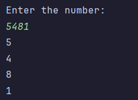
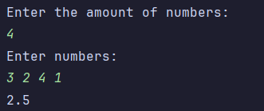
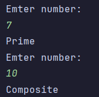
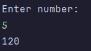
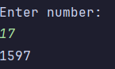
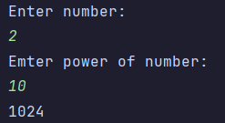
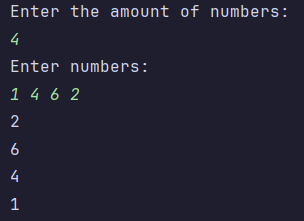
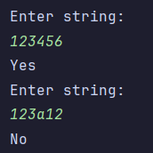
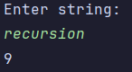
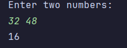

Assignment 1 – Recursion

Name: Nurkhat Assan

Course: SE - 2514

task 1: The function divides the number by 10 and prints the last digit until only one digit remains.

task 2: write numbers, and sum it in recursion. In the end I divede it by the amount of numbers to calculate avg

task 3: I take sqrt of n number, and calculate. If any number until the sqrt give me after devide 0 of reminder it means that number is not prime. But if there is no numbers and my i become higher than n it is prime

task 4: I just multiply n number by the n - 1 (the number before n again and again until 0)

task 5: just plus 2 numbers before n. If there 0 return 0, and if there 1 return 1

task 6: if power is 0 return 1. n^a = n * n^a-1. that's formula and i take it as my logic

task 7: read until the end and return it in reverse form

task 8: if written string not "digit"(not between '0' and '9' in ASCII) it's NO

task 9: just read string and plus 1 to the counter

task 10: gcd(a, b) = gcd(b, a % b) Euclidean algorithm

